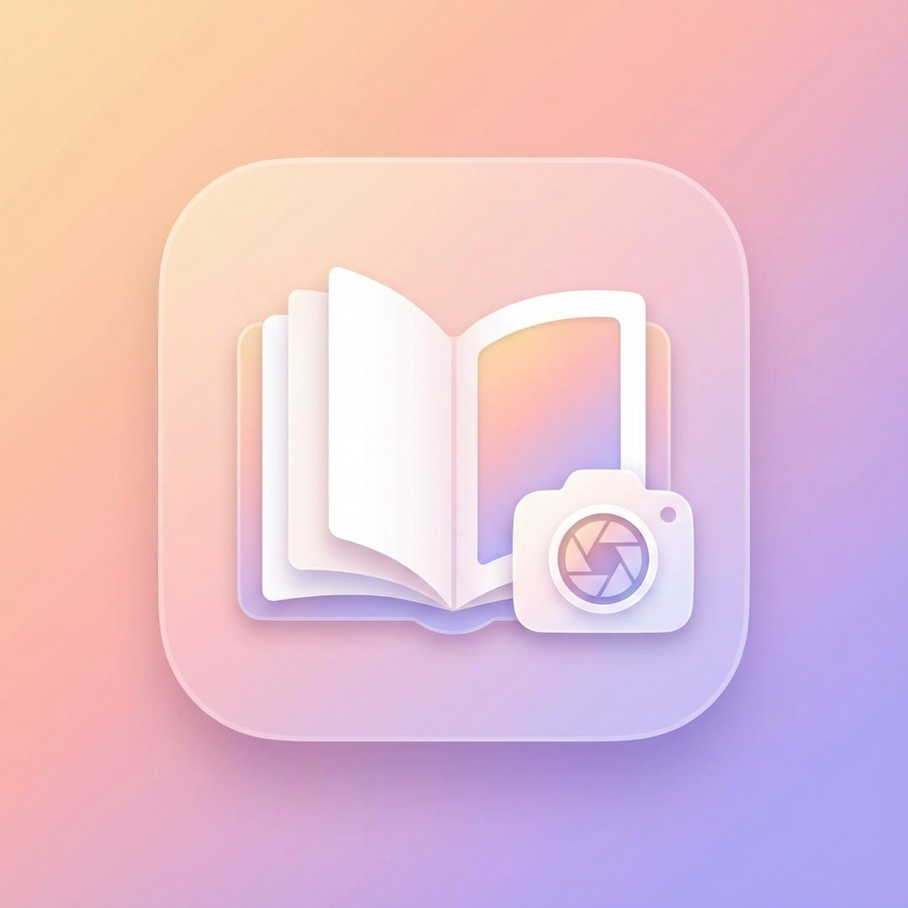

# 📓 Photo Journal

A beautiful, scrapbook-style iOS journal app that lets you write memories alongside your photos.



## ✨ Features

- **Scrapbook Layout**: View your memories in a cute, hand-crafted notebook style interface.
- **Date Organized**: Photos are automatically grouped by Year, Month, and Day.
- **Privacy First**: All journal entries are stored locally on your device. Your data never leaves your phone.
- **Visual & Fun**:
  - Polaroid-style photo frames 📸
  - Decorative graphical elements (tape, stickers) 🎀
  - Handwriting-style fonts ✍️
- **Original Quality**: Preserves your original HEIC photos without modification or quality loss.

## 📱 Screenshots

> *Add screenshots of your app here*

## 🛠 Tech Stack

- **Swift 5**
- **SwiftUI**
- **PhotoKit** (Permissions & Asset fetching)
- **XcodeGen** (Project generation)

## 🚀 Getting Started

### Prerequisites

- Xcode 15.0+
- iOS 16.0+
- [xcodegen](https://github.com/yonaskolb/XcodeGen) (Optional, but recommended for regenerating the project file)

### Installation

1. Clone the repository:
   ```bash
   git clone https://github.com/yourusername/PhotoJournal.git
   ```
2. Open the project:
   ```bash
   open PhotoJournal.xcodeproj
   ```
   *If the project file is missing or you want to regenerate it:*
   ```bash
   brew install xcodegen
   xcodegen generate
   ```

3. Run in Xcode (⌘R).

## 📝 License

This project is open source and available under the [MIT License](LICENSE).
